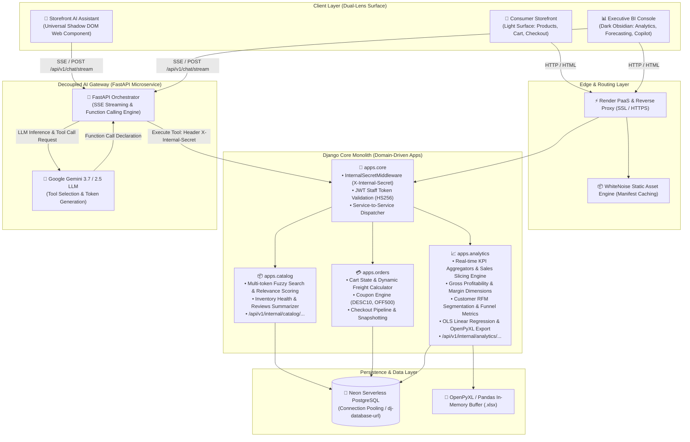

# 🛒 Enterprise E-Commerce Platform & AI-Powered BI Telemetry Engine

[](https://www.python.org/)
[](https://www.djangoproject.com/)
[](https://fastapi.tiangolo.com/)
[](https://neon.tech/)
[](https://ai.google.dev/)
[](https://render.com/)
[](https://pandas.pydata.org/)
[-0A9EDC?style=for-the-badge&logo=pytest&logoColor=white)](https://docs.pytest.org/)
[](https://jwt.io/)

> **A production-grade, full-stack commerce ecosystem and managerial business intelligence engine** combining a modern **Domain-Driven Django Monolith**, an autonomous **FastAPI AI Agent Gateway**, a **Serverless PostgreSQL (Neon.tech)** database, and an interactive **BI & Analytics Console with Real-Time SSE AI Copilots**.
> 
> Engineered from the ground up to showcase enterprise architectural patterns: **Clean Architecture & 12-Factor App principles**, **Decoupled Microservice Communication**, **Server-Sent Events (SSE) Token Streaming**, **Shadow DOM Web Components**, **Statistical Synthetic Data Simulation (Pareto / Zipf / Log-Normal)**, and **100% automated test coverage (143+ Pytest suite)**.

---

## 📑 Table of Contents

- [Executive Summary \& Value Proposition](#-executive-summary--value-proposition)
- [System Architecture \& Data Flow](#-system-architecture--data-flow)
- [Domain-Driven Modular Structure](#-domain-driven-modular-structure)
- [Core Capabilities \& Technical Innovations](#-core-capabilities--technical-innovations)
  - [1. Dual AI Copilot Ecosystem (Storefront + Executive BI)](#1-dual-ai-copilot-ecosystem-storefront--executive-bi)
  - [2. Multi-Layered Fuzzy Search \& Tiered Relevance Scoring](#2-multi-layered-fuzzy-search--tiered-relevance-scoring)
  - [3. Statistical Synthetic Data Simulation Engine](#3-statistical-synthetic-data-simulation-engine)
  - [4. Enterprise Security Contracts \& Secret Shielding](#4-enterprise-security-contracts--secret-shielding)
  - [5. Financial Analytics, OLS Demand Forecasting \& OpenPyXL ETL](#5-financial-analytics-ols-demand-forecasting--openpyxl-etl)
- [🧠 AI Engine Database Tools (Function Calling Catalog)](#-ai-engine-database-tools-function-calling-catalog)
  - [1. Tool Definition \& Mapping Matrix](#1-tool-definition--mapping-matrix)
  - [2. Tool Specifications \& JSON Payloads](#2-tool-specifications--json-payloads)
- [Multi-Environment Settings Pipeline](#-multi-environment-settings-pipeline)
- [Microservice Internal API Contracts](#-microservice-internal-api-contracts)
- [Quality Assurance \& Testing Suite (143+ Tests)](#-quality-assurance--testing-suite-143-tests)
- [Installation \& Local Quickstart](#-installation--local-quickstart)
- [Cloud Deployment (Render \& Neon.tech)](#-cloud-deployment-render--neontech)
- [Engineering Standards \& Design Decisions](#-engineering-standards--design-decisions)

---

## 💎 Executive Summary & Value Proposition

This platform bridges consumer-facing retail transactions with executive-level data analytics and autonomous AI agents. Unlike standard CRUD tutorials, this project solves genuine production challenges:

1. **Decoupled Microservices with High Security:** An external FastAPI AI Agent Gateway orchestrates LLM intelligence via Google Gemini, consuming internal Django REST APIs protected by SHA-256 HMAC JWT verification and header-based service secrets (`X-Internal-Secret`).
2. **Zero-Leakage Shadow DOM AI Widget:** A drop-in universal shopping copilot (`chat-widget.js`) with 100% CSS/DOM encapsulation, streaming Server-Sent Events (SSE) responses with instant fallback to unary JSON.
3. **Managerial BI Telemetry Console:** High-density dark obsidian analytics dashboard (`/analytics/ai-chat/`) featuring dynamic on-the-fly Chart.js generation directly from LLM Markdown tables, live telemetry metrics (latency, token estimation, model detection), and multi-format report exports (Markdown, CSV, JSON, Print-to-PDF).
4. **Deterministic Statistical Data Generation:** Realistic synthetic transaction simulator applying Zipfian power laws to catalog popularity, log-normal pricing distributions, and Pareto distributions ($\alpha = 2.2$) to customer purchasing frequency, with memory-chunked database transactions strictly bounded under $120\text{ MB}$ RAM.
5. **LLM Function Calling Database Tools:** A complete suite of 8 structured database tools exposing sales slicing, inventory health, unit profitability, funnel metrics, reviews sentiment, and RFM customer segmentation directly to the AI agent gateway.
6. **Rock-Solid Engineering Rigor:** 143 automated tests running on `pytest-django`, guaranteeing 100% pass rates across unit logic, domain services, security contracts, and frontend integrations.

---

## 🏛️ System Architecture & Data Flow

The platform utilizes a hybrid architectural model: a high-cohesion **Domain-Driven Django Monolith** handling core transactional commerce, data integrity, and business logic, coupled asynchronously to a lightweight **FastAPI AI Agent Gateway** microservice.



---

## 📂 Domain-Driven Modular Structure

The codebase adheres to Domain-Driven Design (DDD) principles, isolating business models, services, and internal APIs into distinct bounded contexts:

```text
ecommerce_Django/
├── apps/                               # Domain-Driven Bounded Contexts
│   ├── core/                           # Cross-Cutting Infrastructure & Security
│   │   ├── authentication/             # JWT staff token issuance, validation & services
│   │   │   ├── services.py             # validate_staff_jwt_token, generate_user_jwt_token
│   │   │   └── views.py                # POST /api/v1/internal/auth/validate-token/
│   │   ├── middleware.py               # InternalSecretMiddleware (X-Internal-Secret inspection)
│   │   ├── internal_urls.py            # /api/v1/internal/ centralized route dispatcher
│   │   └── views.py                    # Health check & system status endpoints
│   │
│   ├── catalog/                        # [Domain 1] Catalog, Search & Inventory Management
│   │   ├── models.py                   # Category, Brand, Supplier, Item, Comments (3NF schema)
│   │   ├── services.py                 # Multi-token fuzzy search & tiered relevance ranking engine
│   │   ├── internal_views.py           # Catalog search & inventory internal endpoints
│   │   ├── views.py                    # Storefront catalog browsing, product detail, CRUD
│   │   ├── forms.py & admin.py         # Catalog validation forms & administrative tooling
│   │   └── urls.py                     # Public catalog routing
│   │
│   ├── orders/                         # [Domain 2] Shopping Cart, Pricing & Checkout Pipeline
│   │   ├── models.py                   # Order, OrderItem (historical price snapshots), Profile
│   │   ├── services.py                 # Cart operations, coupon rules, international freight calculation
│   │   ├── views.py                    # Cart manipulation, checkout flows, authentication controllers
│   │   ├── context_processors.py       # JWT token & user avatar context injectors
│   │   ├── forms.py & admin.py         # Checkout forms & order fulfillment admin
│   │   └── urls.py                     # Orders and checkout routing
│   │
│   └── analytics/                      # [Domain 3] Business Intelligence, Simulation & Copilot
│       ├── services/                   # Decoupled Business Intelligence Service Layer
│       │   ├── kpi_service.py          # Real-time managerial KPIs & aggregation engine
│       │   ├── forecast_service.py     # OLS linear regression demand forecasting & seasonality
│       │   ├── margins_service.py      # Gross profitability & unit economics calculations
│       │   ├── query_engine_service.py # Multidimensional sales aggregation engine (temporal/categorical)
│       │   ├── etl_service.py          # OpenPyXL & Pandas streaming Excel export pipeline
│       │   └── generator_service.py    # Multi-threaded synthetic dataset simulator (Pareto / Zipf)
│       ├── internal_views.py           # Business metrics & AI database tool endpoints
│       ├── views.py                    # Dark Dashboard, Forecasting view, Simulator, AI Copilot
│       ├── data_ingestion.py           # Amazon Reviews 2023 metadata parser & cache
│       ├── management/commands/        # CLI commands: generate_data.py, audit_dataset.py
│       └── urls.py                     # Analytics dashboard routing
│
├── config/                             # Enterprise Modular Settings & Configuration
│   ├── wsgi.py / asgi.py               # WSGI/ASGI entrypoints for Gunicorn / Uvicorn
│   ├── urls.py                         # Root URL routing dispatcher
│   └── settings/                       # 12-Factor Multi-Environment Settings
│       ├── base.py                     # Shared base settings, logging, and database defaults
│       ├── local.py                    # Local developer environment (DEBUG=True)
│       ├── production.py               # Cloud production settings (SSL, WhiteNoise, Security headers)
│       └── testing.py                  # High-speed in-memory testing configuration
│
├── static/                             # Static Assets
│   ├── js/                             # chat-widget.js (Shadow DOM Universal AI Component)
│   ├── css/                            # Storefront light theme & Analytics obsidian theme
│   └── img/                            # Product assets & brand iconography
│
├── templates/                          # Dual-Surface Domain Templates
│   ├── base.html                       # Base layout for consumer storefront
│   ├── catalog/                        # Catalog, search, and product detail templates
│   ├── orders/                         # Cart summary, checkout, and profile templates
│   └── analytics/                      # Executive dashboard, forecast, and AI Copilot console
│
├── tests/                              # Comprehensive Pytest QA & Security Suite (143+ Tests)
│   ├── test_internal_security.py       # X-Internal-Secret middleware contract tests
│   ├── test_auth_contract.py           # JWT token validation & cryptographic signature tests
│   ├── test_catalog_contract.py        # Catalog search internal API contract tests
│   ├── test_catalog_search_refinements.py # Fuzzy search tokenizer & relevance ranking tests
│   ├── test_analytics_contract.py      # Analytics metrics internal API contract tests
│   ├── test_analytics_ai_chat.py       # Staff authentication & Copilot permissions tests
│   ├── test_analytics_chat.py          # Copilot frontend & chat endpoint integration tests
│   ├── test_chat_widget_integration.py # Shadow DOM widget scripts & DOM isolation tests
│   └── test_frontend_integration.py    # Multi-surface frontend & context processor tests
│
├── .env.example                        # Secure environment variables template
├── build.sh                            # CI/CD automated deployment script for Render
├── pytest.ini                          # Pytest discovery and configuration settings
├── requirements.txt                    # Production & development dependencies
└── manage.py                           # Django CLI manager (defaults to config.settings.local)
```

---

## ⚡ Core Capabilities & Technical Innovations

### 1. Dual AI Copilot Ecosystem (Storefront + Executive BI)

The platform features two distinct AI interfaces powered by Google Gemini and decoupled FastAPI streaming:

#### A. Universal Drop-in Storefront Copilot (`chat-widget.js`)
- **Zero CSS Leakage via Shadow DOM:** Implemented as a standalone, framework-agnostic JavaScript component that attaches to a custom Shadow Root (`mode: 'open'`). It guarantees 100% DOM and styling isolation regardless of host site CSS.
- **Server-Sent Events (SSE) Streaming:** Connects to `POST /api/v1/chat/stream`, rendering incoming token streams in real-time. Features an automatic fallback to `POST /api/v1/chat` unary JSON if the browser or network interrupts streaming.
- **Multi-Turn Session Persistence:** Automatically maintains unique session tokens in `sessionStorage`, persisting chat history across page navigation without database overhead.
- **Programmatic API:** Exposes `window.AiChatWidget` with methods (`open()`, `close()`, `toggle()`, `sendMessage()`) for programmatic control.

#### B. Managerial BI Telemetry Copilot (`/analytics/ai-chat/`)
- **Real-Time Markdown-to-Chart.js Transformation:** When the AI agent responds with Markdown tables, the frontend automatically renders an interactive toolbar allowing operators to convert tabular data into dynamic Chart.js visualizations on the fly, with hot-switching between **Bar, Line, Doughnut, and Pie** charts.
- **Live Telemetry & Diagnostics Sidebar:** Displays real-time operational telemetry including exact request latency in milliseconds, active Gemini model identifier (`gemini-3.7-flash` / `gemini-2.5`), estimated prompt/completion token count, and live gateway heartbeat status.
- **Multi-Format Export Suite:** Managers can export AI-generated reports and analyses to **Markdown (.md)**, **CSV (.csv)**, **JSON (.json)**, or trigger a clean **Print-to-PDF** layout.

---

### 2. Multi-Layered Fuzzy Search & Tiered Relevance Scoring

Product search in `apps.catalog.services.search_catalog_service` does not rely on naive `icontains` queries. It implements a multi-pass tokenized search algorithm with tiered relevance ranking:

$$\text{Relevance Score} = \sum \text{Phrase Match Weights} + \sum \text{Token Match Weights}$$

```text
┌──────────────────────────────────────────────────────────────────────────┐
│                           SEARCH QUERY PIPELINE                          │
│  Input: "Precio: $1,200 (Wireless Gaming Mouse)"                         │
│  1. Prefix Stripping: Cleans "Precio:", "Price:"                         │
│  2. Delimiter Removal: Strips () $ , " ' : ; ! ?                         │
│  3. Stop-Word Filtering: Strips common Spanish & English particles       │
│  4. Output Tokens: ['wireless', 'gaming', 'mouse']                       │
└────────────────────────────────────┬─────────────────────────────────────┘
                                     │
             ┌───────────────────────┴───────────────────────┐
             ▼                                               ▼
┌──────────────────────────────┐              ┌──────────────────────────────┐
│    EXACT PHRASE SCORING      │              │    INDIVIDUAL TOKEN SCORING  │
│  • Title Match:       +100   │              │  • Title Match:       +10    │
│  • Brand Match:       +80    │              │  • Brand Match:       +8     │
│  • Category Match:    +60    │              │  • Category Match:    +5     │
│  • Description Match: +40    │              │  • Description Match: +2     │
└──────────────────────────────┘              └──────────────────────────────┘
```

- **Query Optimization:** Single database round-trip utilizing `select_related('category', 'brand', 'supplier')` to eliminate N+1 queries.
- **Clamped Pagination:** Safely clamps limits between 1 and 50 items.

---

### 3. Statistical Synthetic Data Simulation Engine

The data generation engine (`apps.analytics.services.generator_service`) builds realistic e-commerce datasets using real Amazon Reviews 2023 metadata paired with rigorous statistical distributions:

1. **Zipfian Brand & Supplier Distribution:** Simulates market dominance where a handful of top suppliers account for the majority of catalog volume:
   $$w_i = \frac{1}{i^{1.5}} \quad \text{for } i \in [1, N_{\text{suppliers}}]$$
2. **Log-Normal Product Pricing:** Reflects realistic retail price dispersion with long tails:
   $$\text{Price} = \min\left(50000, \max\left(100, \exp(\mathcal{N}(\mu=8, \sigma=1.5))\right)\right)$$
3. **Pareto Order Frequency:** Models the classic 80/20 rule where a minority of power buyers generate the bulk of transactions, while 25% of registered users remain inactive:
   $$\text{Orders per User} \sim \text{Pareto}(\alpha = 2.2)$$
4. **Historical Inflation & Seasonality:** Orders simulated across a 24-month horizon factor in a monthly compound inflation rate ($(1 + r)^t$) and seasonal spikes (November/December holiday surges).
5. **Memory-Bounded Streaming Transactions:** Inserts orders and order items in streaming chunks of 500 records with explicit garbage collection (`gc.collect()`), keeping memory usage strictly below **120 MB RAM** to operate safely within cloud container limits.

---

### 4. Enterprise Security Contracts & Secret Shielding

| Security Layer | Implementation Mechanism | Protection Level |
|---|---|---|
| **Service-to-Service Auth** | `InternalSecretMiddleware` inspecting `X-Internal-Secret` | Rejects unauthorized microservice calls with `401 Unauthorized` |
| **Staff JWT Verification** | SHA-256 HMAC JWT verification via PyJWT | Enforces user existence, active status, and `is_staff` / `is_superuser` claims |
| **Signature Tampering** | Cryptographic HMAC secret verification | Rejects forged signatures and expired tokens with `401 Unauthorized` |
| **Relational Integrity** | `unique_together = ('user', 'item')` on reviews | Enforces single-review constraint per user at the database level |
| **Production Headers** | `SECURE_SSL_REDIRECT`, `SESSION_COOKIE_SECURE`, `CSRF_COOKIE_SECURE`, `X_FRAME_OPTIONS = 'DENY'` | Mitigates XSS, clickjacking, and session hijacking |
| **Zero Committed Secrets** | `.gitignore` shields `.env`, databases, and caches | Zero sensitive tokens or private keys tracked in Git history |

---

### 5. Financial Analytics, OLS Demand Forecasting & OpenPyXL ETL

#### A. Ordinary Least Squares (OLS) Demand Forecasting
The forecasting engine (`apps.analytics.services.forecast_service`) analyzes historical monthly revenue trends and calculates a 3-month predictive linear model with standard error confidence bounds:

$$\text{Slope } (m) = \frac{n \sum (xy) - \sum x \sum y}{n \sum (x^2) - (\sum x)^2}, \quad \text{Intercept } (b) = \frac{\sum y - m \sum x}{n}$$

$$\text{Standard Error } (\text{SE}) = \sqrt{\frac{\sum (y_i - \hat{y}_i)^2}{n - 2}}, \quad \text{Confidence Margin} = \text{SE} \times (1.0 + 0.15 \times \text{step})$$

#### B. Streaming OpenPyXL & Pandas ETL Pipeline
The ETL service (`apps.analytics.services.etl_service`) streams order and profit margins directly into formatted Excel spreadsheets (`.xlsx`) using `Workbook(write_only=True)` and database `.iterator(chunk_size=2000)`. It calculates historical unit cost, unit price, subtotal, net profit, and gross profit margin on the fly without loading the full dataset into memory.

---

## 🧠 AI Engine Database Tools (Function Calling Catalog)

The autonomous FastAPI AI Gateway executes **Function Calling** via Google Gemini by dispatching queries to a specialized suite of internal database tools. All tools communicate with Django's internal API layer protected by the `X-Internal-Secret` security contract.

### 1. Tool Definition & Mapping Matrix

| Tool Name (LLM Function) | Django Internal Endpoint | HTTP | Primary Responsibility |
|---|---|:---:|---|
| **`query_sales_analytics`** | `/api/v1/internal/analytics/sales-query/` | `GET` | Slices revenue, volume, and profit across temporal (`day`/`week`/`month`/`quarter`) and catalog dimensions. |
| **`get_inventory_health`** | `/api/v1/internal/catalog/inventory-health/` | `GET` | Identifies out-of-stock SKUs, critical safety-stock deficits, and calculates total inventory valuation. |
| **`get_product_profitability`** | `/api/v1/internal/analytics/margins/` | `GET` | Evaluates gross margins and net profit ranked by product, category, brand, or supplier dimensions. |
| **`get_funnel_and_cart_metrics`** | `/api/v1/internal/analytics/funnel-metrics/` | `GET` | Monitors conversion funnel stages, cart abandonment rates, coupon usage, and payment distributions. |
| **`get_customer_reviews_summary`**| `/api/v1/internal/catalog/reviews-summary/` | `GET` | Aggregates star rating distributions, verified customer sentiment, and top/low-rated catalog items. |
| **`get_customer_segmentation`** | `/api/v1/internal/analytics/customer-segments/` | `GET` | Performs RFM (Recency, Frequency, Monetary) clustering, domestic vs. foreign ratios, and churn risk. |
| **`semantic_catalog_search`** | `/api/v1/internal/catalog/search/` | `GET` | Executes multi-term fuzzy search with tiered relevance scoring and stock availability filters. |
| **`execute_raw_sql_sandbox`** | `/api/v1/internal/analytics/sql-sandbox/` | `POST` | Executes parameterized read-only `SELECT` queries with strict AST safety, timeout guards, and row caps. |

---

### 2. Tool Specifications & JSON Payloads

#### 1. `query_sales_analytics`
Allows the AI Copilot to answer complex multi-dimensional questions like: *"Show me weekly revenue and gross margin for Electronics over the last quarter."*

* **Parameters:** `group_by` (`day`|`week`|`month`|`quarter`|`category`|`brand`|`supplier`|`country`|`payment_method`), `date_from` (`YYYY-MM-DD`), `date_to` (`YYYY-MM-DD`), `status` (`PAID`|`SHIPPED`|`DELIVERED`|`PENDING`), `limit` (`int`).
* **Response Payload Example:**
```json
{
  "query_metadata": {
    "group_by": "category",
    "date_from": "2026-01-01",
    "date_to": "2026-08-01",
    "total_groups": 18,
    "limit": 3
  },
  "summary": {
    "total_revenue": 348250.00,
    "total_orders": 2840,
    "total_units": 6120,
    "avg_order_value": 122.62,
    "total_gross_profit": 178500.00,
    "avg_gross_margin_pct": 51.26
  },
  "data": [
    {
      "dimension": "Electronics",
      "revenue": 142500.00,
      "orders_count": 1150,
      "units_sold": 2400,
      "total_cost": 67200.00,
      "gross_profit": 75300.00,
      "gross_margin_pct": 52.84,
      "avg_order_value": 123.91
    },
    {
      "dimension": "Home_and_Kitchen",
      "revenue": 89400.00,
      "orders_count": 780,
      "units_sold": 1650,
      "total_cost": 41800.00,
      "gross_profit": 47600.00,
      "gross_margin_pct": 53.24,
      "avg_order_value": 114.62
    }
  ]
}
```

#### 2. `get_inventory_health`
Equips the AI Copilot to detect replenishment risks and out-of-stock products before supply bottlenecks occur.

* **Parameters:** `status` (`critical`|`out_of_stock`|`healthy`|`all`), `category` (`str`), `limit` (`int`).
* **Response Payload Example:**
```json
{
  "inventory_summary": {
    "total_skus": 240,
    "out_of_stock_count": 6,
    "critical_stock_count": 14,
    "total_stock_units": 18450,
    "total_inventory_valuation": 892400.00
  },
  "critical_items": [
    {
      "id": 104,
      "title": "Ergonomic Mechanical Keyboard RGB",
      "category": "Electronics",
      "current_stock": 2,
      "minimum_stock": 15,
      "reorder_deficit": 13,
      "supplier": "TechSupply Co.",
      "unit_cost": 45.00
    }
  ]
}
```

#### 3. `get_product_profitability`
Answers high-impact executive questions regarding unit economics and product/brand contribution margins.

* **Parameters:** `dimension` (`product`|`category`|`brand`|`supplier`), `order_by` (`margin_desc`|`margin_asc`|`revenue_desc`|`profit_desc`), `limit` (`int`).
* **Response Payload Example:**
```json
{
  "dimension": "product",
  "order_by": "margin_desc",
  "overall_margin": {
    "total_revenue": 148520.50,
    "total_cost": 71200.00,
    "total_gross_profit": 77320.50,
    "overall_margin_pct": 52.06
  },
  "results": [
    {
      "item_id": 88,
      "title": "USB-C Dual 4K Docking Station",
      "category": "Electronics",
      "brand": "Anker",
      "revenue": 24990.00,
      "cost": 8750.00,
      "gross_profit": 16240.00,
      "gross_margin_pct": 64.99,
      "units_sold": 100
    }
  ]
}
```

#### 4. `get_funnel_and_cart_metrics`
Surfaces critical e-commerce conversion health, cart drop-off rates, and coupon discount impacts.

* **Parameters:** `period` (`last_7_days`|`last_30_days`|`last_90_days`|`all_time`).
* **Response Payload Example:**
```json
{
  "conversion_funnel": {
    "total_carts_created": 1450,
    "completed_checkouts": 1210,
    "abandoned_carts": 240,
    "abandonment_rate_pct": 16.55,
    "overall_conversion_rate_pct": 83.45
  },
  "coupon_intelligence": {
    "orders_with_coupons": 280,
    "coupon_utilization_rate_pct": 23.14,
    "total_discount_given": 28450.00,
    "top_performing_coupon": "DESC10"
  },
  "payment_distribution": {
    "CREDIT_CARD": 68.4,
    "DEBIT_CARD": 21.2,
    "MERCADO_PAGO": 10.4
  }
}
```

#### 5. `get_customer_reviews_summary`
Analyzes real customer feedback, average ratings, and review distribution across product lines.

* **Parameters:** `category` (`str`), `min_rating` (`int`), `limit` (`int`).
* **Response Payload Example:**
```json
{
  "category_filter": "Electronics",
  "total_reviews": 412,
  "average_rating": 4.68,
  "rating_breakdown": {
    "5_star": 290,
    "4_star": 88,
    "3_star": 22,
    "2_star": 8,
    "1_star": 4
  },
  "top_rated_item": {
    "item_id": 42,
    "title": "Logitech MX Master 3S Wireless Mouse",
    "avg_rating": 4.92,
    "reviews_count": 48
  }
}
```

#### 6. `get_customer_segmentation`
Provides data-driven RFM segmentation and customer demographic breakdown.

* **Parameters:** `segment` (`all`|`champions`|`loyal`|`at_risk`|`new`), `limit` (`int`).
* **Response Payload Example:**
```json
{
  "customer_base": {
    "total_registered_users": 5000,
    "active_buyers": 3750,
    "inactive_churned": 1250,
    "international_customer_ratio_pct": 20.0
  },
  "rfm_clusters": {
    "champions_high_ltv": 412,
    "loyal_steady_buyers": 1120,
    "promising_recent": 890,
    "at_risk_churn_warning": 580,
    "dormant": 748
  }
}
```

#### 7. `semantic_catalog_search`
Powers conversational product recommendations and contextual discovery for the storefront assistant.

* **Parameters:** `q` (`str`), `category` (`str`), `limit` (`int`).
* **Response Payload Example:**
```json
{
  "total_found": 1,
  "limit": 5,
  "items": [
    {
      "id": 42,
      "title": "Logitech MX Master 3S Wireless Mouse",
      "price": 99.99,
      "stock": 145,
      "is_available": true,
      "category": "Electronics",
      "brand": "Logitech",
      "url": "http://127.0.0.1:8000/product/42/"
    }
  ]
}
```

#### 8. `execute_raw_sql_sandbox`
Enables the AI Copilot to run sandboxed, safe SQL analytical queries on behalf of technical operators.

* **Request Payload (POST):**
```json
{
  "query": "SELECT item__category__name, SUM(subtotal) AS total_revenue FROM order_items_v GROUP BY item__category__name ORDER BY total_revenue DESC LIMIT 3;"
}
```
* **Response Payload (200 OK):**
```json
{
  "columns": ["item__category__name", "total_revenue"],
  "rows": [
    ["Electronics", 142500.00],
    ["Home_and_Kitchen", 89400.00],
    ["Sports_and_Outdoors", 54300.00]
  ],
  "row_count": 3,
  "execution_time_ms": 11.4,
  "sandboxed": true
}
```

---

## ⚙️ Multi-Environment Settings Pipeline

The project implements a 12-Factor modular settings architecture under `config/settings/`:

```text
config/settings/
├── base.py         # Shared defaults, INSTALLED_APPS, Middleware, dj-database-url
├── local.py        # Local development (DEBUG=True, SQLite fallback, verbose logging)
├── production.py   # Cloud deployment (DEBUG=False, SSL Redirect, WhiteNoise Manifest)
└── testing.py      # Fast Pytest execution (In-memory SQLite, MD5 fast password hasher)
```

- **Local Execution:**
  ```bash
  python manage.py runserver --settings=config.settings.local
  ```
- **Production Execution:**
  ```bash
  gunicorn config.wsgi:application --env DJANGO_SETTINGS_MODULE=config.settings.production
  ```
- **Automated Testing:**
  ```bash
  python -m pytest --ds=config.settings.testing
  ```

---

## 🔌 Microservice Internal API Contracts

All internal endpoints reside under `/api/v1/internal/` and require the `X-Internal-Secret: <token>` HTTP header.

### 1. Catalog Search Endpoint
`GET /api/v1/internal/catalog/search/`

- **Query Parameters:** `q` (search string), `category` (category ID or name), `limit` (int, default 10, max 50).
- **Response (200 OK):**
```json
{
  "total_found": 1,
  "limit": 10,
  "items": [
    {
      "id": 42,
      "title": "Logitech MX Master 3S Wireless Mouse",
      "description": "Ergonomic wireless performance mouse with 8K DPI sensor.",
      "price": 99.99,
      "stock": 145,
      "is_available": true,
      "category": "Electronics",
      "brand": "Logitech",
      "url": "http://127.0.0.1:8000/product/42/",
      "image_url": "http://127.0.0.1:8000/uploads/products/mx3s.jpg"
    }
  ]
}
```

### 2. Business Analytics & Metrics Endpoint
`GET /api/v1/internal/analytics/metrics/`

- **Query Parameters:** `metric_type` (`overview` | `kpis` | `forecast` | `sales_trend` | `category_distribution` | `top_products` | `all`).
- **Response (200 OK - `metric_type=all`):**
```json
{
  "metric_type": "all",
  "overview": {
    "current_month": "August 2026",
    "monthly_revenue": 148520.50,
    "monthly_orders": 1240,
    "avg_order_value": 119.77,
    "active_customers": 980,
    "abandoned_carts": 42,
    "top_product_star": {
      "product_id": 15,
      "title": "Noise-Cancelling Bluetooth Headphones",
      "category": "Electronics",
      "price": 249.99,
      "total_units_sold": 310,
      "total_revenue_generated": 77496.90
    }
  },
  "forecast": {
    "next_month_projected": 156200.00,
    "mom_growth_pct": 5.2,
    "seasonality_index": 1.18,
    "forecast_3_months": {
      "months": ["Sep 2026 (F)", "Oct 2026 (F)", "Nov 2026 (F)"],
      "projected_revenue": [156200.0, 163500.0, 185400.0],
      "upper_bound": [164000.0, 172000.0, 196000.0],
      "lower_bound": [148400.0, 155000.0, 174800.0]
    }
  }
}
```

### 3. Staff JWT Validation Endpoint
`POST /api/v1/internal/auth/validate-token/`

- **Request Body:** `{"token": "<jwt_string>"}`
- **Response (200 OK):**
```json
{
  "valid": true,
  "user": {
    "id": 1,
    "username": "admin_exec",
    "email": "exec@enterprise.com",
    "is_staff": true,
    "is_superuser": true
  }
}
```

---

## 🧪 Quality Assurance & Testing Suite (143+ Tests)

The platform is fortified with **143 automated Pytest tests** with 100% pass status, verifying domain calculations, security boundaries, and edge cases:

```bash
============================= test session starts =============================
platform win32 -- Python 3.11.0, pytest-9.1.1, pluggy-1.6.0
django: version: 4.1.2, settings: config.settings.testing (from ini)
rootdir: C:\Users\facur\Documents\ecommerce_Django
plugins: anyio-4.14.2, Faker-22.5.1, django-4.14.0
collected 143 items

apps\analytics\tests.py ........                                         [  5%]
apps\catalog\tests.py ...                                                [  7%]
apps\orders\tests.py ...                                                 [  9%]
tests\test_analytics_ai_chat.py .......                                  [ 14%]
tests\test_analytics_chat.py ......................                      [ 30%]
tests\test_analytics_contract.py ...........                             [ 37%]
tests\test_auth_contract.py ..............                               [ 47%]
tests\test_catalog_contract.py .....................                     [ 62%]
tests\test_catalog_search_refinements.py ..............                  [ 72%]
tests\test_chat_widget_integration.py ........                           [ 77%]
tests\test_frontend_integration.py ..............                        [ 87%]
tests\test_internal_security.py ..........                               [ 94%]
tests\test_catalog_search_refinements.py ....                            [ 97%]
tests\test_frontend_integration.py ....                                  [100%]

======================= 143 passed, 1 warning in 9.90s ========================
```

### Test Suite Breakdown

- **`tests/test_internal_security.py` (10 tests):** Verifies `InternalSecretMiddleware` header checks, 401 unauthorized handling on missing/invalid secret, and non-internal route bypass.
- **`tests/test_auth_contract.py` (14 tests):** Validates HS256 JWT decoding, active user verification, staff permission checks (403 Forbidden for non-staff), expired token rejection, and HMAC signature tampering defenses.
- **`tests/test_catalog_contract.py` (21 tests):** Tests internal search API parameter validation, limit clamping (1-50), bad request handling, and method constraints (405 on POST/PUT).
- **`tests/test_catalog_search_refinements.py` (18 tests):** Evaluates multi-term tokenization, stop-word filtering, price prefix stripping, and exact vs. token relevance rank weighting.
- **`tests/test_analytics_contract.py` (11 tests):** Validates schema consistency across all metric types (`overview`, `forecast`, `category_distribution`, `top_products`, `all`).
- **`tests/test_analytics_ai_chat.py` & `test_analytics_chat.py` (29 tests):** Validates staff-only view permissions, context processor token injectors, chat history structures, and streaming endpoints.
- **`tests/test_chat_widget_integration.py` (8 tests):** Verifies Shadow DOM script tag injection, data attribute parsing, and CSS isolation.
- **`tests/test_frontend_integration.py` (18 tests):** Tests navigation flows, dark console layout rendering, and user profile avatar injectors.
- **`apps/analytics/tests.py`, `apps/catalog/tests.py`, `apps/orders/tests.py` (14 tests):** Tests OLS regression mathematical calculations, review database uniqueness constraints, and dynamic cart freight/coupon logic.

---

## 🚀 Installation & Local Quickstart

### 1. Clone & Setup Virtual Environment
```bash
# Clone repository
git clone https://github.com/facur/ecommerce_Django.git
cd ecommerce_Django

# Create and activate virtual environment
# Windows (PowerShell):
python -m venv venv
.\venv\Scripts\Activate.ps1

# Linux / macOS:
python3 -m venv venv
source venv/bin/activate

# Install dependencies
pip install -r requirements.txt
```

### 2. Configure Environment Variables
Copy `.env.example` to create your local `.env`:
```bash
cp .env.example .env
```

Ensure `.env` contains:
```env
DJANGO_SECRET_KEY=your-secure-local-secret-key-32-chars
DJANGO_DEBUG=True
DJANGO_ALLOWED_HOSTS=127.0.0.1,localhost
DATABASE_URL=
INTERNAL_API_SECRET=your-shared-internal-secret-token-32-chars
GEMINI_API_KEY=your-google-gemini-api-key
AI_AGENT_GATEWAY_URL=https://ai-agent-gateway-sued.onrender.com
```

### 3. Database Migration & Statistical Seeding
```bash
# Run database migrations
python manage.py migrate

# Generate statistical synthetic data (Amazon metadata + Pareto/Zipfian simulation)
python manage.py generate_data

# Create superuser for managerial access
python manage.py createsuperuser
```

### 4. Run Development Server & Test Suite
```bash
# Execute 143+ Pytest suite
python -m pytest

# Start Django development server
python manage.py runserver
```

| Interface | Local URL | Description |
|---|---|---|
| **🛒 Consumer Storefront** | `http://127.0.0.1:8000/` | Public catalog, cart, checkout & Shadow DOM AI Assistant |
| **📊 Managerial BI Copilot** | `http://127.0.0.1:8000/analytics/ai-chat/` | Dark obsidian console with dynamic Chart.js generation & live telemetry |
| **📈 Executive KPI Dashboard** | `http://127.0.0.1:8000/analytics/dashboard/` | Real-time sales KPIs, category share & top products |
| **🔮 Demand Forecasting** | `http://127.0.0.1:8000/analytics/forecast/` | OLS linear regression demand predictions & seasonality |
| **🛠️ Synthetic Data Simulator** | `http://127.0.0.1:8000/analytics/simulator/` | Parameterized transaction simulator controls |
| **⚙️ Django Administration** | `http://127.0.0.1:8000/admin/` | Standard Django admin interface |

---

## ☁️ Cloud Deployment (Render & Neon.tech)

The platform is engineered for zero-downtime deployment on **Render** backed by a **Neon.tech Serverless PostgreSQL** database.

### Automated Build Pipeline (`build.sh`)
```bash
#!/usr/bin/env bash
# Exit immediately if a command exits with a non-zero status
set -o errexit

pip install -r requirements.txt
python manage.py collectstatic --no-input --settings=config.settings.production
python manage.py migrate --settings=config.settings.production
```

### Production Gunicorn Start Command
```bash
gunicorn config.wsgi:application --bind 0.0.0.0:$PORT --workers 2 --threads 4 --timeout 120
```

### Key Production Infrastructure Components
- **Neon Serverless PostgreSQL:** Managed connection pooling with SSL mode enforcement (`sslmode=require`) and automatic query caching via `dj-database-url`.
- **WhiteNoise Static Caching:** `CompressedManifestStaticFilesStorage` ensures unique content-hashed filenames, gzip/Brotli compression, and infinite far-future cache headers.
- **SSL / HTTPS Termination:** Strict enforcement of `SECURE_SSL_REDIRECT = True` and secure session/CSRF cookies.

---

## 📐 Engineering Standards & Design Decisions

```text
┌─────────────────────────────────────────────────────────────────────────────┐
│                           KEY DESIGN DECISIONS                              │
├──────────────────────────────┬──────────────────────────────────────────────┤
│ Decision                     │ Rationale & Business Impact                  │
├──────────────────────────────┼──────────────────────────────────────────────┤
│ Domain-Driven Modular Apps   │ Eliminates monolithic coupling; each app has │
│ (core, catalog, orders, etc) │ isolated models, services, and internal APIs.│
├──────────────────────────────┼──────────────────────────────────────────────┤
│ Decoupled FastAPI Gateway    │ Offloads long-running LLM SSE streaming from │
│                              │ WSGI threads, preventing web server starvation│
├──────────────────────────────┼──────────────────────────────────────────────┤
│ LLM Database Tools Catalog   │ Exposes high-speed typed analytical tools    │
│ (8 Function Calling Endpoints│ for autonomous AI Copilot multi-turn insights│
├──────────────────────────────┼──────────────────────────────────────────────┤
│ Shadow DOM Web Component     │ Zero CSS leakage on host storefront pages;   │
│                              │ true drop-in portability across web clients. │
├──────────────────────────────┼──────────────────────────────────────────────┤
│ Memory-Chunked Simulation    │ Caps generator memory consumption < 120 MB   │
│                              │ for seamless execution on 512 MB cloud RAM.  │
├──────────────────────────────┼──────────────────────────────────────────────┤
│ 100% Pytest Contract Suite   │ Ensures microservice security contracts and  │
│ (143+ automated tests)       │ mathematical formulas remain bug-free.       │
└──────────────────────────────┴──────────────────────────────────────────────┘
```

---

## 👨‍💻 Author & Engineering Leadership

Built with craftsmanship by **Facundo Rossi** — Senior Full-Stack Software Engineer & Solutions Architect.

- **LinkedIn:** [linkedin.com/in/facundo-rossi](https://linkedin.com/in/facundo-rossi)
- **GitHub:** [@facur](https://github.com/facur)
